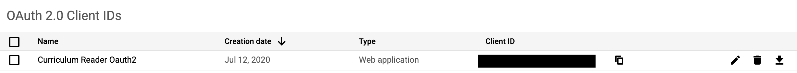

# rfa-pwa
robotics for all thing

### todo
- add pwa functionality
- add cookies to detect previous page
- rejigger so it lookz niaze
- google analytics
- change font, maybe look into convert to real materialize
- hide logo when screen size is too small
# pipe dream
- react native rewrite

## Instructions to work on backend

### Setup

[node.js](https://nodejs.org/en/download/) and [npm](https://www.npmjs.com/get-npm) need to be installed.

Install all necessary packages using `npm install`.

#### Necessary files in the [/params/](params/) folder

The following files represent the files that need to be present inside the params folder in the main directory.

##### params.json

Add a file called `params.json` in the params folder with the JSON shown below. Alternatively, run `npm run-script build` in console to have the program generate the default file for you.

```json
{
	"FOLDER_ID":"ID OF CURRICULUM FOLDER"
}
```

The only requirement here is to place in the ID of the curriculum folder, which can be found on the drive of the `app@roboticsforall.net` account. This can be found easily by opening the curriculum folder, and when inside, the url should be of the form `https://drive.google.com/drive/folders/<Folder ID>` where the area represented by the angular brackets represents the folder ID. Simply copy this and replace `ID OF CURRICULUM FOLDER` with this text. Remember not to leave the surrounding quotations.

##### client_secret.json

This can be obtained from google console. First, go to [console.cloud.google.com](https://console.cloud.google.com/) and log in with `app@roboticsforall.net`. Under the **Select a project** dropdown, choose `Curriculum-Access-API`

Next, navigate to the credentials tab in APIs & Services, as shown in the photo below.


Under the `OAuth 2.0 Client IDs` tab there will be a client ID for the `Curriculum Reader Oauth2.` At the far right of this row there is a download icon, as shown in the photo below.



Download the file and rename it to `client_secret.json`. Then, place the renamed file into the `params` folder.

### Building the app

Run `npm build` or `npm run-script build` to build the app.
